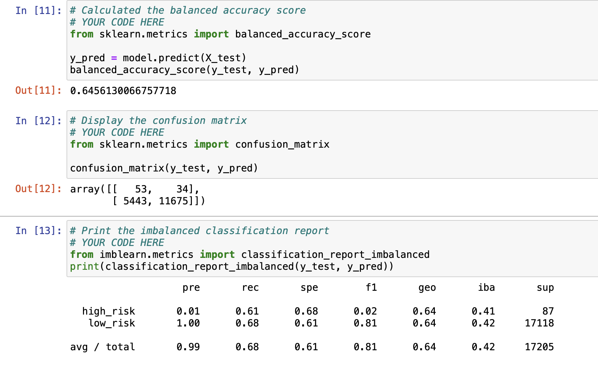
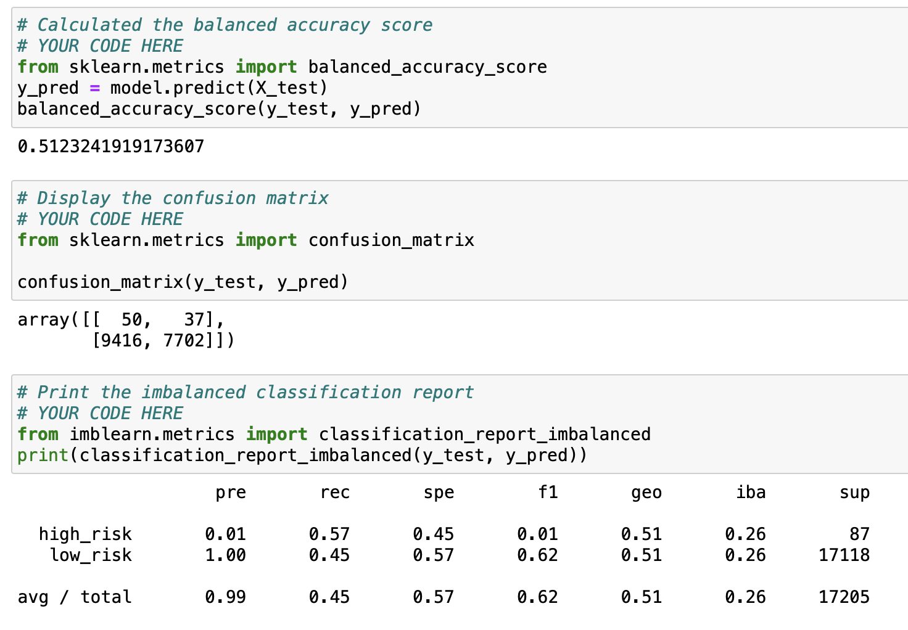
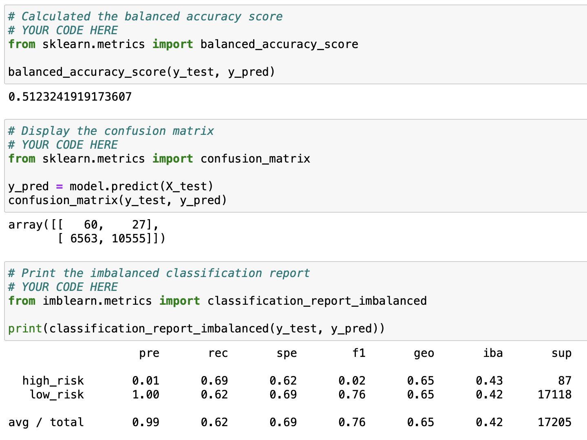
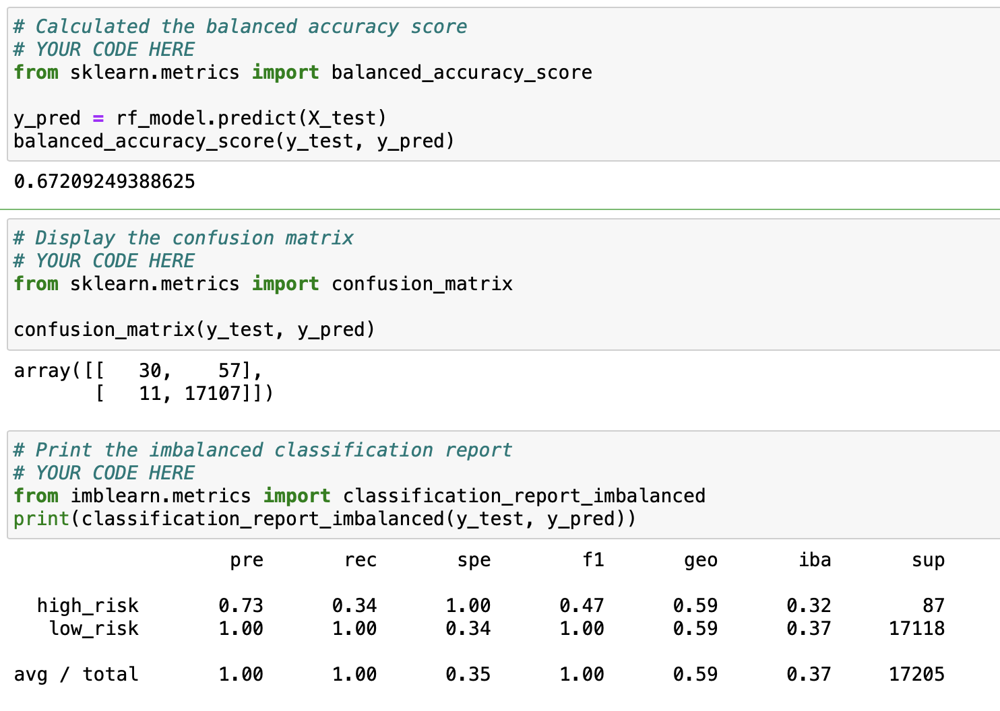
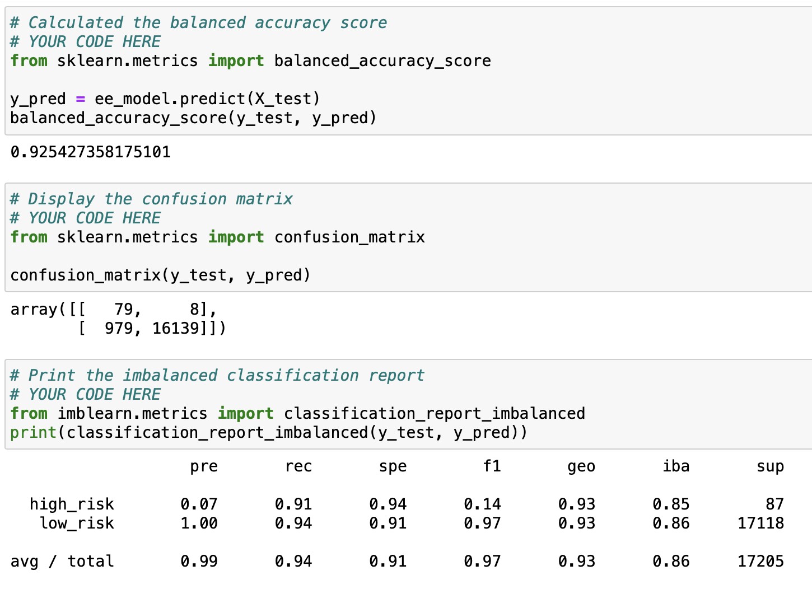

# Credit_Risk_Analysis

## Overview of the analysis: 
The purpose of this analysis is to use a credit card credit dataset from LendingClub, a peer-to-peer lending services company, to determine which factors make a credit card application high or low risk for a lender. 

## Results: 

I will list the accuracy results of each model below with screenshots from the data. 

### - Random Over Sampling:

### - SMOTE Over Sampling:

### - Cluster Centroids Over Sampling: 

### - SMOTEENN:

### - Balanced Random Forest Classifier:

### - Easy Ensemble Adaboost Classifier:

## Summary: 

In summary, the accuracy scores for five of the the six supervised machine learning methods used range between 51% and 67% with the exception of the Easy Ensemble mehtod which is about 91% accurate. For this reason, I recommend the Easy Ensemble method to identify loans for auto acception because you want to minimize the risk that you accept as a lender. This model will most accurately identify applications that closely align with this model saving loan agents' time to review those applications which do not closely align with the identified influencing factors.  
