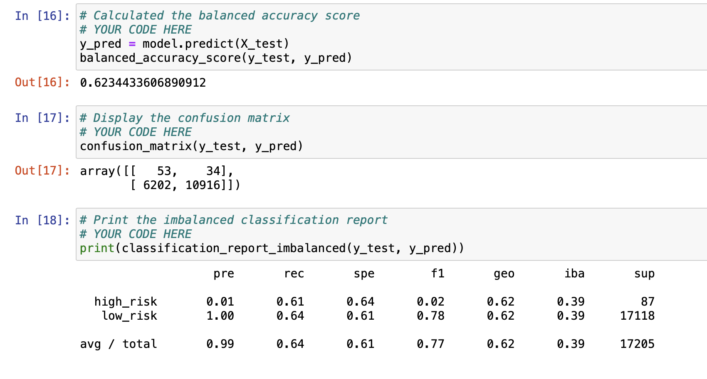

# Credit_Risk_Analysis

## Overview of the analysis: 
The purpose of this analysis is to use a credit card credit dataset from LendingClub, a peer-to-peer lending services company, to determine which factors make a credit card application high or low risk for a lender. 

## Results: 

I will list the accuracy results of each model below with screenshots from the data. 

### - Random Over Sampling:

### - SMOTE Over Sampling:

### - Cluster Centroids Over Sampling: 

### - SMOTEENN:

### - Balanced Random Forest Classifier:

### - Easy Ensemble Adaboost Classifier:

## Summary: 

Summarize the results of the machine learning models, and include a recommendation on the model to use, if any. If you do not recommend any of the models, justify your reasoning.
